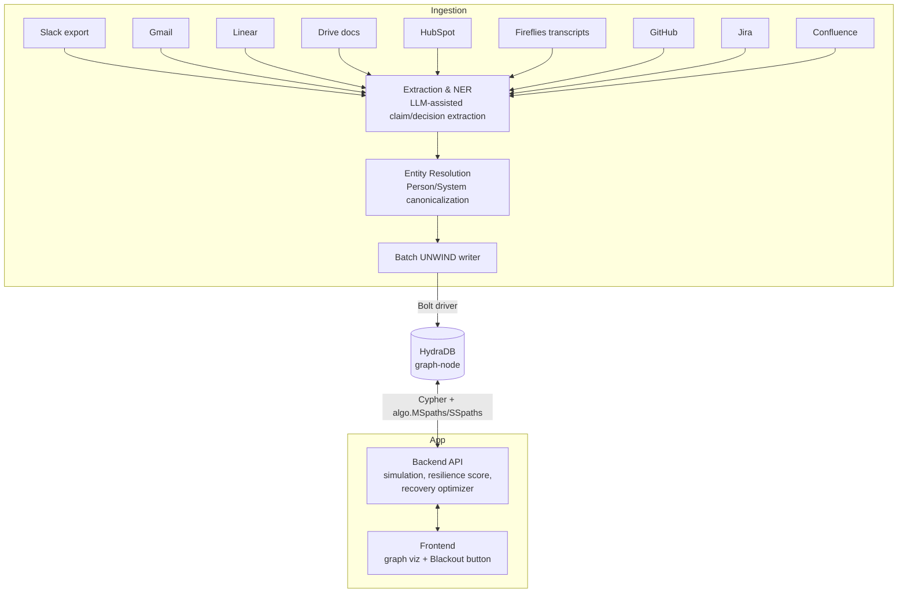

# BLACKOUT — Product Requirements Document
### Chaos testing for enterprise knowledge, built on HydraDB
**Hack Hydra 2026 · Track 01 — Enterprise Context & Ontology**

---

## 1. One-Line Pitch

BLACKOUT simulates the removal of a person, source, or system from an organization's knowledge graph and instantly shows which claims become unverifiable, which decisions lose their evidence, and — critically — the minimum set of actions that restore the most coverage.

Not "here is a knowledge graph." **"Here is what your company would forget."**

---

## 2. Research Grounding — why this gap is real and unfilled

**The problem is well-documented, but only for one narrow slice of it.**

Every existing tool that touches this space measures the same thing: git commit authorship. Swimm, ContributorIQ, and CNCF's OSS health metrics all compute "bus factor" from code contribution history — who wrote which files, how concentrated the commits are. That's useful, but it only sees code. It has no concept of a *decision*, a *claim*, or *evidence* — and it cannot see Slack, meeting transcripts, HubSpot, or Confluence at all.

The pain itself is large and quantified:
- Employers report knowledge loss from departures as a top-3 operational concern; industry surveys put the productivity hit at roughly 10% of a workweek lost to re-discovering context, with measurably longer incident-resolution times when the knowledgeable person is unavailable.
- Forrester-cited research puts time lost searching for information at close to 12 hours/week per employee.
- The literature is unanimous that "bus factor" as currently tooled stops at source code. Nobody has extended it to **cross-source organizational claims** — the actual decisions, policies, and rationale that live scattered across Slack threads, tickets, and docs, contradicting each other, with no single system tracking which ones have zero backup.

**The white space:** a graph that models *claims* and *evidence paths* across all nine of a company's systems, and can answer "what becomes unverifiable if X disappears" — not "who committed this file." That query has never been productized. It requires exactly what a vector database cannot do (multi-hop structural reachability under node/edge removal) and exactly what HydraDB is built for (snapshot-scoped graph traversal at scale).

---

## 3. Goals

| # | Goal |
|---|---|
| G1 | Ingest the Track 01 dataset (Slack, Gmail, Linear, Drive, HubSpot, Fireflies, GitHub, Jira, Confluence) into a claims-and-evidence graph in HydraDB. |
| G2 | Resolve entities across sources ("Sam," "@soham," "S. Ratnaparkhi" → one person) so removal simulations are trustworthy. |
| G3 | Let a user simulate removing a **source**, a **person**, or a **document**, and see the exact set of claims/decisions/projects that lose all supporting evidence. |
| G4 | Surface a single **Knowledge Resilience Score** that moves visibly when a simulated removal happens. |
| G5 | Generate a **ranked recovery plan** — the smallest set of concrete actions that restores the most coverage. |
| G6 | Ship a 2-minute demo that a non-technical judge understands in the first 20 seconds. |

### Non-Goals (explicitly out of scope for the hackathon build)
- Real HR integration / actual employee offboarding workflows.
- Automatic document rewriting or auto-generated documentation.
- General-purpose enterprise search or chat-with-your-docs.
- Perfect entity resolution — a strong best-effort resolver with visible confidence is sufficient; this is a demo, not a shipped product.

---

## 4. Track & Judging Alignment

| Judging criterion (from the hackathon rubric) | How BLACKOUT answers it |
|---|---|
| Technical execution | Real multi-hop graph traversal under simulated node removal, at the scale of the provided ~500K-document dataset. |
| Use of HydraDB / graph-native approach | The entire mechanism — "does an evidence path survive node removal" — is unanswerable by a vector index and native to `algo.SSpaths`/`algo.MSpaths` plus snapshot-pinned reads. |
| Product completeness & usability | One interactive screen: pick a node, hit "remove," watch the graph react, get a recovery plan. |
| Quality of results | Concrete numbers (claims lost, decisions affected, resilience score delta) instead of vague summarization. |
| Originality | No existing tool computes cross-source, claim-level, evidence-path removal simulation — confirmed against the current bus-factor tooling landscape, which is code-authorship-only. |

Track fit is Track 01 specifically because the track's own problem statement calls out **entity resolution and conflict resolution** as "the hard part" — BLACKOUT's `SUPERSEDES` and `CONTRADICTS` edges solve exactly that requirement as a side effect of building the resilience mechanism, not as a bolt-on.

---

## 5. Personas & Core User Story

**Persona: Priya, VP of Engineering.** She doesn't think in graph queries. She thinks in "what happens if Sam takes another job."

> As Priya, I want to simulate a key person or system disappearing, so that I can see exactly which decisions and systems would become unverifiable — and get a concrete, prioritized list of what to fix before it happens, not after.

Secondary persona: **the hackathon judge**, who needs to understand the value proposition from a single query and a single visual, in under 30 seconds.

---

## 6. Data Model

### 6.1 Node labels

| Label | Key properties | Source |
|---|---|---|
| `Person` | `canonical_id`, `name`, `aliases[]`, `resolved_confidence` | resolved across all 9 sources |
| `Document` | `id`, `title`, `source_system`, `url`, `last_modified` | Drive, Confluence |
| `Message` | `id`, `source_system` (Slack/Gmail/Fireflies), `timestamp`, `channel_or_thread` | Slack, Gmail, Fireflies |
| `Ticket` | `id`, `source_system` (Linear/Jira), `status`, `title` | Linear, Jira |
| `PullRequest` | `id`, `repo`, `merged_at` | GitHub |
| `Deal` | `id`, `stage` | HubSpot |
| `Claim` | `id`, `text_summary`, `extracted_at`, `status` (`active`/`superseded`) | derived from all sources |
| `Decision` | `id`, `title`, `decided_at` | derived, groups related Claims |
| `Project` / `System` | `id`, `name` | derived from Jira/Linear/GitHub grouping |
| `Incident` | `id`, `severity`, `occurred_at` | Jira/Linear (postmortem tickets) |

### 6.2 Relationship types

```
Person        -[AUTHORED]->        Message | Document | PullRequest
Message       -[SUPPORTS]->        Claim
Document      -[SUPPORTS]->        Claim
Claim         -[PART_OF]->         Decision
Claim         -[CONTRADICTS]->     Claim
Claim         -[SUPERSEDES]->      Claim
Decision      -[IMPLEMENTED_BY]->  PullRequest | Ticket
PullRequest   -[CHANGES]->         System
Ticket        -[RELATES_TO]->      System
System        -[BELONGS_TO]->      Project
System        -[CAUSED]->          Incident
Person        -[OWNS]->            System | Project
Person        -[BACKUP_FOR]->      Person        (derived: co-authorship on same Claims)
```

Every `SUPPORTS` edge carries `{is_sole_evidence: bool}`, computed at write time and recomputed after every simulated removal — this single boolean is what makes "single point of failure" a first-class, queryable fact instead of something inferred at read time.

---

## 7. Core Mechanisms

### 7.1 Entity resolution (satisfies Track 01's stated hard requirement)

A blocking + scoring pipeline (name similarity, email domain matching, Slack handle ↔ email cross-reference, GitHub username ↔ email from commit metadata) merges raw actor references into canonical `Person` nodes before any graph write. Every merge keeps `aliases[]` and a `resolved_confidence` score — displayed in the UI so judges can see the hard problem being handled transparently, not hidden.

### 7.2 Contradiction & supersession resolution

When two `Claim` nodes assert incompatible facts about the same entity, resolution is structural, not a model guess:
1. If one claim has an outgoing `SUPERSEDES` edge to the other and a later `extracted_at`, the older one is marked `status: superseded`.
2. Otherwise, both are marked `CONTRADICTS` and surfaced to the user as an open contradiction — the system explicitly **abstains** rather than picking a side, which directly satisfies the track's requirement to "correctly recognize when the answer just is not in there."

### 7.3 Blast Radius Simulation — the killer mechanism

Given a target node (a `Person`, a `source_system` value, or a `Document`):

1. **Soft-delete simulation, not a real delete.** The removal is expressed as a query-time filter predicate, not a write — the underlying graph is untouched. This matters for the demo (instant, reversible, safe to click repeatedly) and for HydraDB's snapshot model (every simulation run pins one consistent snapshot, so results can't shift mid-query).
2. For every `Claim` reachable from the target node via `AUTHORED`/`SUPPORTS`, check whether at least one *other* evidence path still exists.
3. Claims with **zero surviving evidence paths** are flagged `orphaned`.
4. Decisions where all constituent Claims are orphaned are flagged `unverifiable`.
5. Projects/Systems downstream of unverifiable Decisions are flagged `at risk`.

This is computed with `algo.MSpaths`, batch-resolving many-source-to-many-target reachability in one call instead of one query per claim — the exact use case the procedure is designed for:

```cypher
CALL algo.MSpaths({
  sourceLabel: 'Claim',
  sourceProperty: 'id',
  sourceValues: $affectedClaimIds,
  targetLabel: 'Message',
  targetProperty: 'source_system',
  targetValues: $survivingSourceSystems,
  pairwise: false,
  relTypes: ['SUPPORTS'],
  relDirection: 'in',
  maxLen: 1,
  pathCount: 2,
  resultLimit: 5000
})
YIELD path
RETURN path
```
Claims with zero returned paths after the target node's edges are filtered out are the orphaned set.

### 7.4 Knowledge Resilience Score

A single number, 0–100, computed as a weighted function of:
- `% of active Claims with ≥2 independent SUPPORTS paths` (the "backup coverage" term)
- `% of Decisions with zero orphaned constituent Claims`
- inverse of the count of `is_sole_evidence: true` edges touching high-`Ticket`/`Incident`-degree Systems (criticality weighting)

Recomputed before and after every simulation; the delta (e.g., "82 → 51") is the headline number in the demo.

### 7.5 Recovery Plan Optimizer

A **greedy set-cover** over the orphaned-claims set: for each candidate repair action (link an existing but unlinked Document to a Decision, assign a `BACKUP_FOR` relationship from a connected Person, etc.), compute how many currently-orphaned Claims it would restore. Take the highest-impact action, remove its covered claims from the remaining set, repeat. This is O(actions × orphaned claims) — trivial at hackathon scale, and produces exactly the ranked "1. Capture Decision D-184 in Confluence — restores 14 claims" output the demo needs.

### 7.6 Cross-training recommendation

For a removed `Person`, find the `Person` nodes with the shortest existing `BACKUP_FOR` or co-`AUTHORED`-on-same-Claim path who are **not already orphaned themselves** — via `algo.SSpaths` from the removed person's node, `relTypes: ['BACKUP_FOR', 'AUTHORED']`, bounded to 2–3 hops. This produces "closest connected expert" without a second bespoke query engine.

---

## 8. HydraDB Feature Utilization (explicit, for judging on "use of HydraDB")

| Feature | Where it's load-bearing, not decorative |
|---|---|
| Snapshot-consistent reads | Every simulation run and its resilience-score delta must read against one pinned state — flipping mid-calculation would silently corrupt the "before vs after" comparison that is the entire demo. |
| `algo.MSpaths` (batched, `pairwise`) | Blast-radius computation is fundamentally a many-source reachability check; without native batching this becomes thousands of client-side round trips against a 500K-document graph. |
| `algo.SSpaths` | Cross-training / "closest connected expert" lookup. |
| `causal` vs `strong` consistency | Routine dashboard browsing (resilience leaderboard, source list) reads `causal` for speed; the moment a user commits a simulated removal and expects an authoritative resilience-score delta, the read escalates to `strong` so the number shown is never based on stale replicated state — a real, user-visible distinction, not a cosmetic toggle. |
| Object-store durability / full history | Not core to the MVP demo, but positions a v2 feature: "resilience score over time" as a trend line, which the durable WAL history supports without extra infrastructure. |
| Bolt / OpenCypher compatibility | Lets the ingestion pipeline and app backend use a standard Neo4j driver, minimizing custom client code and hackathon build risk. |

---

## 9. System Architecture



**Ingestion pipeline detail:**
1. Raw exports/API pulls per source → normalized JSON records.
2. LLM-assisted extraction pass converts messages/documents/tickets into candidate `Claim` and `Decision` nodes with `SUPPORTS`/`PART_OF` edges (single Claude call per document/thread, batched).
3. Entity resolution pass merges Person references; writes `Person` nodes with `aliases[]`.
4. Contradiction pass links `Claim`↔`Claim` via `CONTRADICTS`/`SUPERSEDES` using recency + explicit-correction language heuristics.
5. Batched `UNWIND`-based Cypher writes load everything into HydraDB in bulk rather than row-by-row.

**App backend responsibilities:**
- `/simulate` endpoint: accepts `{targetType, targetId}`, runs the blast-radius query set, returns orphaned claims/decisions/systems + resilience delta.
- `/recover` endpoint: runs the greedy set-cover optimizer over the current orphaned set.
- `/graph` endpoint: streams the affected subgraph for visualization.

**Frontend:** a force-directed graph view (existing JS graph library) with a source/person picker and a single prominent "💥 Simulate Removal" button; results panel shows the four headline numbers, the resilience score gauge, the single-source-knowledge callout, and the ranked recovery list.

---

## 10. 9-Day Build Plan

| Days | Milestone |
|---|---|
| 1–2 | Stand up HydraDB locally, define schema, build extraction pipeline for 2–3 sources first (Slack, Confluence, GitHub) to validate the Claim/Decision model end-to-end on a small slice. |
| 3–4 | Entity resolution pass; expand ingestion to remaining sources; batch-load into HydraDB; validate with sample Cypher queries. |
| 5 | Implement blast-radius simulation via `algo.MSpaths`; implement resilience score calculation. |
| 6 | Implement recovery optimizer + cross-training recommender (`algo.SSpaths`). |
| 7 | Frontend: graph visualization + simulate button + results panel. |
| 8 | Integration pass, seed 3–4 guaranteed-to-land "hero" scenarios (a real single-source decision, a real cross-source contradiction) so the demo never depends on live discovery. |
| 9 | Record 3-minute demo video, finalize README (HydraDB usage explanation required by submission rules), write submission form, open-source license, final repo cleanup. |

**Risk mitigation:** the entity-resolution and extraction steps are the highest-risk parts of the timeline. Mitigate by hand-seeding 3–4 guaranteed dramatic scenarios (a payments decision with genuinely one piece of evidence, a pricing contradiction between two sources) directly into the graph on Day 2, independent of whether the automated pipeline finds them itself — the demo must not depend on LLM extraction quality under time pressure.

---

## 11. Demo Script (2:00)

| Time | Beat |
|---|---|
| 0:00–0:15 | "Your company thinks it has one source of truth. It doesn't." Show the full enterprise graph. |
| 0:15–0:30 | Click **Simulate: [Person] leaves**. Graph animates outward — orphaned claims highlighted in red. |
| 0:30–0:50 | Click into one orphaned claim: "The only surviving evidence for this payments decision was a Slack thread authored by [Person]." |
| 0:50–1:05 | Click **Simulate: Remove Slack** on top of that. Show the resilience score drop live: 82 → 51. |
| 1:05–1:25 | Click **Recovery Plan**: "Capture Decision D-184 in Confluence → restores 14 claims." Show the ranked list. |
| 1:25–1:45 | "Who should we cross-train?" → closest connected expert recommendation with a concrete backup assignment. |
| 1:45–2:00 | Close: "BLACKOUT doesn't tell you what your company knows. It tells you what your company would forget." |

---

## 12. Success Metrics for the Submission Itself

- Demo runs live against the actual provided dataset (not a synthetic toy graph) for at least the ingested-source subset.
- At least one genuinely surprising, real single-source-of-truth finding surfaced in the recorded demo.
- Resilience score visibly and correctly changes on simulation.
- README explicitly documents where HydraDB is used and what the project would lose without it (required by submission rules).
- Repo has no commits before Aug 12, 2026; includes an open-source license.

---

## 13. Submission Checklist (from hackathon rules)

- [ ] Public GitHub repo, fresh, first commit on/after Aug 12, 2026
- [ ] Open-source license included
- [ ] README with setup instructions + explicit HydraDB usage explanation
- [ ] Attribution for datasets/libraries used
- [ ] 3-minute (or under) demo video, unlisted YouTube link acceptable
- [ ] Submission form: project name, description, problem, what was built, tech stack, team contributions, repo link, video link
- [ ] Submitted before Aug 20, 2026, 11:59 PM PT
